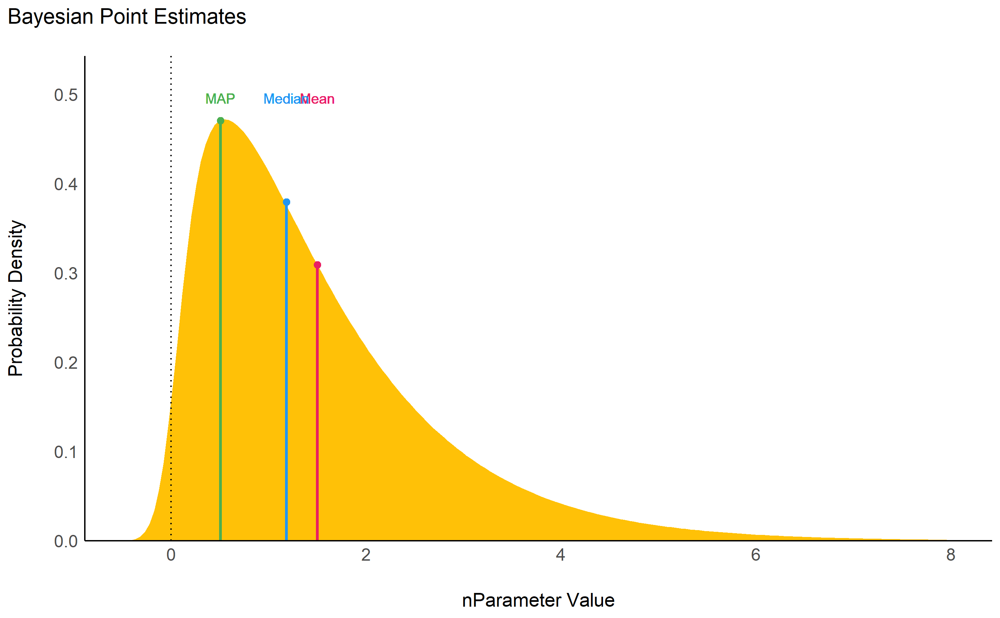
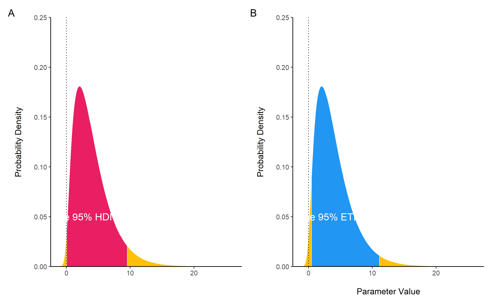

# bayestestR 

[](https://cran.r-project.org/package=bayestestR)
[](https://cran.r-project.org/package=bayestestR)
[](https://travis-ci.org/easystats/bayestestR)
[](https://codecov.io/gh/easystats/bayestestR)
[](https://zenodo.org/badge/latestdoi/165641861)

***Become a Bayesian master you will***

The Bayesian framework for statistics is quickly gaining in popularity
among scientists, for reasons such as reliability and accuracy
(particularly in noisy data and small samples), the possibility to
incorporate prior knowledge into the analysis or the intuitive
interpretation of results. Bayesian statistics compute the probability
of different effects *given the observed data*. Instead of having
estimates of the “true effect”, the probabilistic approach gives a
distribution of possible values for the parameters, called the
*posterior distribution*.

The uncertainty in Bayesian inference can be summarized, for instance,
by the *median* of the distribution, as well as a range of values of the
posterior distribution that includes the 95% most probable values (the
95% *credible interval*). In essence, the Bayesian sampling algorithms
(such as MCMC sampling) return a probability distribution (*the
posterior*) of an effect that is compatible with the observed data. The
effect can be described by [characterizing the posterior
distribution](https://easystats.github.io/bayestestR/articles/guidelines.html)
of the related effect in relation to its centrality (point-estimates),
uncertainty, existance and significane.

Packages for R already exist that mostly help users to compute
point-estimates or uncertainty intervals, and in particular to visualize
posterior draws from Bayesian models. However, to our knowledge, there
are no packages that provide a comprehensive and consistent set of
functions to also analyize and describe the existance of effects, and
their “significance” (in terms of evidence for the existence of
effects). `bayestestR` is lightweight package that provides tools to
compute and report these indices from a variety of models objects,
including popular modeling packages such as `rstanarm`, `brms` or
`BayesFactor`. The main functions are described below, but we also like
to point users to the [accompanying
website](https://easystats.github.io/bayestestR).

## Installation

Run the following:

``` r
install.packages("devtools")
devtools::install_github("easystats/bayestestR")
```

``` r
library("bayestestR")
```

## Documentation

[](https://easystats.github.io/bayestestR/)
[](https://easystats.github.io/blog/posts/)
[](https://easystats.github.io/bayestestR/reference/index.html)

Click on the buttons above to access the package
[**documentation**](https://easystats.github.io/bayestestR/) and the
[**easystats blog**](https://easystats.github.io/blog/posts/), and
check-out these vignettes:

#### Tutorials

  - [Get Started with Bayesian
    Analysis](https://easystats.github.io/bayestestR/articles/bayestestR.html)
  - [Example 1: Initiation to Bayesian
    models](https://easystats.github.io/bayestestR/articles/example1.html)
  - [Example 2: Confirmation of Bayesian
    skills](https://easystats.github.io/bayestestR/articles/example2.html)
  - [Example 3: Become a Bayesian
    master](https://easystats.github.io/bayestestR/articles/example3.html)

#### Articles

  - [Credible Intervals
    (CI)](https://easystats.github.io/bayestestR/articles/credible_interval.html)
  - [Probability of Direction
    (pd)](https://easystats.github.io/bayestestR/articles/probability_of_direction.html)
  - [Region of Practical Equivalence
    (ROPE)](https://easystats.github.io/bayestestR/articles/region_of_practical_equivalence.html)
  - [Bayes Factors
    (BF)](https://easystats.github.io/bayestestR/articles/bayes_factors.html)
  - [Comparison of
    Point-Estimates](https://easystats.github.io/bayestestR/articles/indicesEstimationComparison.html)
  - [Comparison of Indices of Effect
    Existence](https://easystats.github.io/bayestestR/articles/indicesExistenceComparison.html)
  - [Reporting
    Guidelines](https://easystats.github.io/bayestestR/articles/guidelines.html)

# Features

[**`describe_posterior()`**](https://easystats.github.io/bayestestR/reference/describe_posterior.html)
is the master function with which you can compute all of the indices
cited below *at once*.

``` r
describe_posterior(rnorm(1000))
```

## Point-estimates

### MAP Estimate

[**`map_estimate()`**](https://easystats.github.io/bayestestR/reference/map_estimate.html)
find the **Highest Maximum A Posteriori (MAP)** estimate of a posterior,
*i.e.,* the most probable value.

``` r
map_estimate(rnorm(1000, 1, 1))
```

<!-- -->

## Uncertainty

### Highest Density Interval (HDI) - The *Credible* Interval (CI)

[**`hdi()`**](https://easystats.github.io/bayestestR/reference/hdi.html)
computes the **Highest Density Interval (HDI)** of a posterior
distribution, *i.e.*, the interval which contains all points within the
interval have a higher probability density than points outside the
interval. The HDI can be used in the context of Bayesian posterior
characterisation as **Credible Interval (CI)**.

Unlike equal-tailed intervals (see
[ci](https://easystats.github.io/bayestestR/reference/ci.html)) that
typically exclude 2.5% from each tail of the distribution, the HDI is
*not* equal-tailed and therefore always includes the mode(s) of
posterior distributions.

By default, `hdi()` returns the 89% intervals (`ci = 0.89`), deemed to
be more stable than, for instance, 95% intervals (Kruschke, 2014). An
effective sample size of at least 10.000 is recommended if 95% intervals
should be computed (Kruschke 2014, p. 183ff). Moreover, 89 is the
highest prime number that does not exceed the already unstable 95%
threshold (McElreath, 2015).

``` r
hdi(rnorm(1000), ci = .89)
```

<!-- -->

## Null-Hypothesis Significance Testing (NHST)

### ROPE

[**`rope()`**](https://easystats.github.io/bayestestR/reference/rope.html)
computes the proportion (in percentage) of the HDI (default to the 89%
HDI) of a posterior distribution that lies within a region of practical
equivalence.

Statistically, the probability of a posterior distribution of being
different from 0 does not make much sense (the probability of it being
different from a single point being infinite). Therefore, the idea
underlining ROPE is to let the user define an area around the null value
enclosing values that are *equivalent to the null* value for practical
purposes (Kruschke 2010, 2011, 2014).

Kruschke (2018) suggests that such null value could be set, by default,
to the -0.1 to 0.1 range of a standardized parameter (negligible effect
size according to Cohen, 1988). This could be generalized: For instance,
for linear models, the ROPE could be set as `0 +/- .1 * sd(y)`. This
ROPE range can be automatically computed for models using the
[rope\_range](https://easystats.github.io/bayestestR/reference/rope_range.html)
function.

Kruschke (2010, 2011, 2014) suggests using the proportion of the 95% (or
90%, considered more stable) HDI that falls within the ROPE as an index
for “null-hypothesis” testing (as understood under the Bayesian
framework, see
[equivalence\_test](https://easystats.github.io/bayestestR/reference/equivalence_test.html)).

``` r
rope(rnorm(1000, 1, 1), range = c(-0.1, 0.1))
```

<!-- -->

### Equivalence test

[**`equivalence_test()`**](https://easystats.github.io/bayestestR/reference/equivalence_test.html)
a **Test for Practical Equivalence** based on the *“HDI+ROPE decision
rule”* (Kruschke, 2018) to check whether parameter values should be
accepted or rejected against an explicitly formulated “null hypothesis”
(*i.e.*, a
[ROPE](https://easystats.github.io/bayestestR/reference/rope.html)).

``` r
equivalence_test(rnorm(1000, 1, 1), range = c(-0.1, 0.1))
```

### Probability of Direction (*p*d)

[**`p_direction()`**](https://easystats.github.io/bayestestR/reference/p_direction.html)
computes the **Probability of Direction** (***p*d**, also known as the
Maximum Probability of Effect - *MPE*). It varies between 50% and 100%
(*i.e.*, `0.5` and `1`) and can be interpreted as the probability
(expressed in percentage) that a parameter (described by its posterior
distribution) is strictly positive or negative (whichever is the most
probable). It is mathematically defined as the proportion of the
posterior distribution that is of the median’s sign. Although
differently expressed, this index is fairly similar (*i.e.*, is strongly
correlated) to the frequentist ***p*-value**.

**Relationship with the p-value**: In most cases, it seems that the *pd*
corresponds to the frequentist one-sided *p*-value through the formula
`p-value = (1-pd/100)` and to the two-sided *p*-value (the most commonly
reported) through the formula `p-value = 2*(1-pd/100)`. Thus, a `pd` of
`95%`, `97.5%` `99.5%` and `99.95%` corresponds approximately to a
two-sided *p*-value of respectively `.1`, `.05`, `.01` and `.001`. See
the [*reporting
guidelines*](https://easystats.github.io/bayestestR/articles/guidelines.html).

``` r
p_direction(rnorm(1000, mean = 1, sd = 1))
```

<!-- -->

### Bayes Factor

[**`bayesfactor_savagedickey()`**](https://easystats.github.io/bayestestR/reference/bayesfactor_savagedickey.html)
computes the ratio between the density of a single value (typically the
null) of two distributions. When the compared distributions are the
posterior and the prior distributions, this results is an approximation
of a Bayes factor comparing the model against a model in which the
parameter of choice is restricted to the point null.

``` r
prior <- rnorm(1000, mean = 0, sd = 1)
posterior <- rnorm(1000, mean = 1, sd = 0.7)

bayesfactor_savagedickey(posterior, prior, direction = "two-sided", hypothesis = 0)
```

<!-- -->

### MAP-based *p*-value

[**`p_map()`**](https://easystats.github.io/bayestestR/reference/p_map.html)
computes a Bayesian equivalent of the p-value, related to the odds that
a parameter (described by its posterior distribution) has against the
null hypothesis (*h0*) using Mills’ (2014, 2017) *Objective Bayesian
Hypothesis Testing* framework. It is mathematically based on the density
at the Maximum A Priori (MAP) and corresponds to the density value at 0
divided by the density of the MAP estimate.

``` r
p_map(rnorm(1000, 1, 1))
```

<!-- -->

## Utilities

### Find ROPE’s appropriate range

[**`rope_range()`**](https://easystats.github.io/bayestestR/reference/rope_range.html):
This function attempts at automatically finding suitable “default”
values for the Region Of Practical Equivalence (ROPE). Kruschke (2018)
suggests that such null value could be set, by default, to a range from
`-0.1` to `0.1` of a standardized parameter (negligible effect size
according to Cohen, 1988), which can be generalised for linear models to
`-0.1 * sd(y), 0.1 * sd(y)`. For logistic models, the parameters
expressed in log odds ratio can be converted to standardized difference
through the formula `sqrt(3)/pi`, resulting in a range of `-0.05` to
`-0.05`.

``` r
rope_range(model)
```

### Density Estimation

[**`estimate_density()`**](https://easystats.github.io/bayestestR/reference/estimate_density.html):
This function is a wrapper over different methods of density estimation.
By default, it uses the base R `density` with by default uses a
different smoothing bandwidth (`"SJ"`) from the legacy default
implemented the base R `density` function (`"nrd0"`). However, Deng &
Wickham suggest that `method = "KernSmooth"` is the fastest and the most
accurate.

### Perfect Distributions

[**`distribution()`**](https://easystats.github.io/bayestestR/reference/distribution.html):
Generate a sample of size n with near-perfect distributions.

``` r
distribution(n = 10)
```

### Probability of a Value

[**`density_at()`**](https://easystats.github.io/bayestestR/reference/density_at.html):
Compute the density of a given point of a distribution.

``` r
density_at(rnorm(1000, 1, 1), 1)
```

## Credits

You can cite the package as following:

  - Makowski, D., Ben-Shachar M. S., & Lüdecke, D. (2019). *Understand
    and Describe Bayesian Models and Posterior Distributions using
    bayestestR*. Available from
    <https://github.com/easystats/bayestestR>.
    [DOI:10.5281/zenodo.2556486](https://zenodo.org/badge/latestdoi/165641861).
